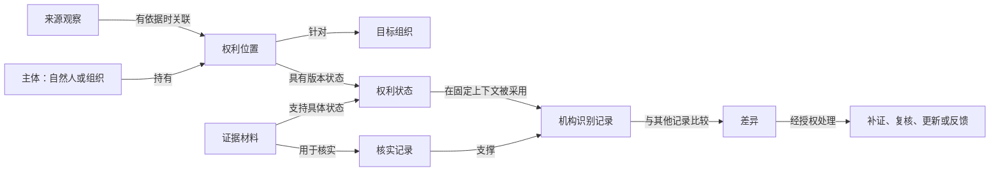

# A01受益所有人领域资产业务审查稿

版本：1.0.0；编制日期：2026-09-09；任务范围：依据指定业务材料和7表结构，生成ECP导入候选包。

本次已设计“谁、对哪个客户、以什么权利、在什么时间、依据什么材料被识别，以及如何复核处理”的业务结构。现有数据可投影来源观察、来源关联及使用限制；不能直接产出完整受益所有人名单、权利形成日期或BOMIS差异结论。文件生成、业务确认、平台导入及数据运行分别记录，最终状态见 [交付报告](../reports/delivery-status.md)。

## 1. 业务任务与结果约定

消费者是金融机构业务经办、合规复核及后续维护人员。目标是形成可以交接核实和持续更新的识别记录。UBO不是自然人身上的永久标签；它是针对客户、适用制度、业务时点和证据上下文作出的机构识别结果。

制度以金融机构识别用的人民银行令〔2025〕第12号为主要依据；备案义务与字段口径另依〔2024〕第3号令、第二版备案指南和本地BOMIS V2.0合同。原文定位及不同规则的适用边界见 [制度复核](../reports/legal-evidence.md)。

| 问题 ID | 业务问题、输入与用途 | 正确结果及禁止结果 | 本次实现与不足处理 | 执行责任 |
| --- | --- | --- | --- | --- |
| CQ-01 | 给定客户、业务时点、客户类型、风险与制度版本，应采用哪种识别方法？ | 有依据的一般、简化、豁免或加强分支；不能仅凭企业标签、国资名称或法代姓名选分支。 | 投影企业与任职来源文本；适用判定UNKNOWN，待类型与风险证据。 | 机构合规确认；本包不自动决策。 |
| CQ-02 | 谁最终拥有、享有收益/表决或实际控制客户，通过什么关系？ | 覆盖所有适用标准的自然人集合及各自权利证据；不能只留推荐人、混加权利比例、直接使用外部实控人名单。 | 投影股东、穿透和控制来源观察。最终比例、候选命中及完整名单BLOCKED。 | Mapping整理来源；未来有前提的计算及机构复核。 |
| CQ-03 | 首次满足条件、当前权利状态形成和终止分别何时？ | 各时间独立、有证据与精度；禁止默认成立、认缴、工商变更、查询或核实日期。 | 声明识别/权利时间概念；股东来源的生效证据限制可派生。具体日期UNKNOWN。 | 经办补生效材料、合规核实填报口径。 |
| CQ-04 | 某历史业务时点，按当时所知或后来回看，权利状态怎样？ | 固定有效时点和知识截止，保留所选材料、旧版本及变化；不能用今天的数据代替历史。 | 现有7表没有完整历史与known_at；历史结果BLOCKED。 | 数据/机构提供历史与采信；未来固定Snapshot/Run。 |
| CQ-05 | 多个客户是否由同一自然人拥有或控制？ | 经身份核实的同一自然人与多个有效识别记录相连，仅作为关联线索；不据此认定可疑或违法。 | 姓名来源保持独立，不执行跨客户自然人归并，结果UNKNOWN。 | 身份核实与关联调查岗位。 |
| CQ-06 | 客户申报、备案查询和机构识别有何差异，差异原因是什么？ | 按同一主体、权利、时间和版本对齐，区分缺失、时间差与事实冲突；重大性有制度依据。 | 本体保留差异和记录来源；三方数据不存在，差异计算BLOCKED。 | 经办沟通核实、合规判定；BOMIS回执归外部系统。 |
| CQ-07 | 每项线索从何而来、能否采用、尚缺什么？ | 可定位来源行及明确限制，分别报告读取、字段/关系和业务事实覆盖；不把扫完表等同识别完整。 | 7表来源投影、9项明示FK关系、2项股东来源使用限制；issues_json明细未投影。 | Mapping、派生说明及数据责任人；可执行性仍待平台预检。 |
| CQ-08 | 变化或差异后谁复核、补证、更新和反馈，如何留痕？ | 待办、责任、正式复核与外部业务回执分别保留；不能以候选、收妥响应或文件生成代替已办结。 | 声明识别/核实/后续处理概念，提供交接约定；无Action Policy或外部动作。 | 场景应用及有权机构人员。 |

所有问题的执行输入都应固定客户、业务时点、知识截止、适用政策和来源快照。当前结构采集时间只证明所提供schema的时点；本次未给任何真实客户指定或伪造这套上下文。

## 2. 核心概念与关系

业务主干为：来源记录陈述某一事实；经核实后，主体与目标组织之间的权利位置才可进入任务事实。权利位置保留状态变化，机构针对所用状态和证据形成识别记录。记录间的差异进入复核与后续处理。源记录的存在不直接建立现实主体、权利或认定。

图中业务关联是目标含义；包内Mapping当前只生成来源观察及其明示来源关联。`a01:`统一展开为 `urn:hovo:ecp:a01-ubo:ontology:`。

| 概念 / IRI | 定义及一个实例的粒度 | 身份、变化与参与关系 | 时间、计量、用途及反例 | 依据 |
| --- | --- | --- | --- | --- |
| 主体 `a01:Subject`；自然人 `NaturalPerson`；组织 `Organization` | 现实世界中的人或组织；“是否已经核实”是知识和工作状态，不是人的本质类型。 | 身份由可核实标识及发放范围确定；更名不自动换主体。同一姓名不自动合并。持有人可为自然人或组织，最终UBO记录才要求自然人。 | CQ-01/02/05。组织持有中间层权益是正例；NULL企业股东ID不是自然人证明。 | SRC-BIZ一、SRC-L12第8条、SRC-SCHEMA |
| 权利位置 `a01:RightsPosition` | 某主体相对某组织、某权利种类、权益类别和分母口径的一项位置；不是一张来源表或一份证据。 | 身份由持有人、目标组织、权利种类、权益类别、分母口径及实际安排共同确定；新增相同证据不新增权益。比例变化产生状态。 | CQ-02/03。所有权、收益、表决和控制分开；共同控制的安排内容要保留，不能把各人持股直接加成控制。 | SRC-BIZ、SRC-L12第8条；手册03 §3 |
| 权利状态 `a01:RightsState` | 一项权利位置在某有效期间的带版本状态记录。 | 通过hasRightsState归属位置；stateSupportedBy指向生效材料。比例、生效安排变更产生新版本；历史更正保留原版本及输入。 | rightsRatio用0至100百分点；有效期间与knownAt分开。当前生效、终止、日期范围和未知状态独立。CQ-03/04；30%变40%不丢首次历史。 | SRC-BIZ二、SRC-G2 5.3 |
| 来源观察 `a01:SourceObservation` | 一条来源记录表达的内容；允许有缺失、冲突和未核实。 | 由数据源命名空间、表和稳定源键定位；内容及批次变化需由未来Snapshot/Run保留。只有取得位置关联依据才建立describesRightsPosition，当前不映射该关系。 | 来源时间不等于业务生效时间。重复观察不重复计算权益。CQ-02/07。 | SRC-SCHEMA；手册01/03 |
| 企业来源记录 `a01:CompanySourceRecord` | 标准化来源中的企业行；不是已核实组织。 | company.id；company_name归并仅反映上游标准化策略；信用代码保留原值。 | 成立日、法代姓名保留来源含义；不从标签判国企或UBO。 | SRC-SCHEMA company |
| 股东来源记录 `a01:ShareholderSourceRecord` | 一条股东及认缴出资观察；不是经核实的实际股权状态。 | shareholder.id；显式FK关联被投企业和匹配到的企业股东记录。 | 认缴比例、金额、币种、日期分别读取，金额单位不明时不推算权益。 | SRC-SCHEMA shareholder |
| 穿透来源观察 `a01:PenetrationObservation` | 根企业下的一条来源穿透观察，保留当前边和对根两种比例。 | penetration.id；保留root/target/owner及股东记录引用。该ID不是已证明的合法路径ID。 | 当前边比例与equityRatioToRoot不互补、不多路径自动求和；终端标志不是自然人。 | SRC-SCHEMA penetration |
| 控制路径边观察 `a01:ControllerPathEdgeObservation` | 外部报告中的一条控制路径边和控制主体线索。 | controller_edge.id；保留路径序、边序、节点标识、类型和原文本。 | 报告的控制、收益和表决比例不等于机构核实事实。CQ-02；来源主体可为组织。 | SRC-SCHEMA controller_edge |
| 任职来源观察 `a01:ExecutiveAppointmentObservation` | 某来源记录报告的一项企业任职，不是自然人的永久属性。 | executive.id及company FK；同人多职可有多条记录，不按姓名归并。 | 无任期字段，不能还原历史职务；任职不自动满足兜底。 | SRC-SCHEMA executive |
| 变更来源观察 `a01:CompanyChangeObservation` | 一项来源记录的变更，保留前后完整原文与摘要。 | company_change.id；同一企业可有多次变更；变更事项与实际权利变化分别核实。 | changeDate仅变更来源日期；摘要用于字节校验不替代原文。 | SRC-BIZ二、SRC-SCHEMA company_change |
| 来源追踪记录 `a01:SourceLineageRecord` | 一条原始源行的ETL去向。 | source_table+source_id联合键；多源行可合并至同一标准行。标准表和ID是来源指针，未建立多态关系。 | 无权利生效和采信时间。问题数组未投影，两个flag不代表全问题。CQ-07。 | SRC-SCHEMA source_row |
| 证据材料 `a01:EvidenceMaterial` | 支持或反驳特定权利/身份主张的材料及其可定位版本。 | 以材料发布方、版本、定位和字节摘要区别；转载同一文件不是独立证据。 | 材料发布、生效、机构获知和采用时间分开；当前未创建真实材料实例。 | SRC-BIZ三、SRC-G2 5.3 |
| 核实记录 `a01:VerificationRecord` | 某责任人在某次核实中对主体/材料及理由形成的记录。 | 一次工作记录，保存使用材料、责任人、时间和结果；新核实不覆写旧记录。 | verifiedOn与权利生效日不同。系统产生提示不是有权人员签认。 | SRC-BIZ三、SRC-L12第4/18条 |
| 识别记录 `a01:IdentificationRecord` | 针对客户、自然人、政策和固定时点所作的一次识别工作记录。 | 客户申报、备案查询、机构拟识别、机构正式记录通过recordOrigin区分；不得相互覆盖。正式权限由机构应用管理。 | businessAsOf、knowledgeCutoff、policyVersion、firstQualifiedOn、filingOn含义不同；considersRightsState及basedOnVerification保留依据。 | SRC-BIZ、SRC-L12/L03/BOMIS |
| 差异 `a01:Discrepancy` | 同一比较上下文下两组记录之间待解释的不一致。 | 相同双方记录、字段和时点的一项比较；版本变更重新比较，不自动认定任何一方错误。 | 日期口径和时点差可解释表面不一致。是否重大及后续措施由制度和核实决定。CQ-06。 | SRC-L12第26至30条 |
| 后续处理 `a01:FollowUpAction` | 经授权决定的补证、复核、更新或反馈工作。 | 独立工作身份与责任人；外部请求、响应、业务回执保留对应关系。 | 触发、执行、回执、办结时间分开；当前只声明类，没有可执行Action Policy。 | SRC-BIZ三、SRC-BOMIS P497 |
| 身份/时间缺口 `a01:IdentityVerificationGap`、`RightsTimeVerificationGap` | 当前股东来源不足以作为身份或权利时间权威的使用限制。 | 每条股东来源行分别生成稳定派生提示并回指原观察。 | 不意味着已识别自然人、已确认存在权利或必须发起特定调查；不含正式认定。CQ-03/07。 | SRC-SCHEMA shareholder |

核心关系均为有方向的业务关系。`RightsPosition.heldBy → Subject`允许组织中间层；`rightsPositionForOrganization → Organization`固定被分析组织；`hasRightsState → RightsState`保存版本；`IdentificationRecord.identifiedNaturalPerson → NaturalPerson`表示受益所有人识别对象。这些domain/range支持类型蕴含，不是数据完整性、身份真实性或审批校验。

当前没有SHACL实例门禁；业务要求中的单值、时间有序、主体唯一性、状态归属、合法采信及比例范围仅完成设计，不宣称已被Runtime强制。未来编译/运行切片必须有对应实例门禁和案例证据。

## 3. 认知机理

### CQ-01：先判适用，再判人

采用客户类型、成立地、组织形式、官方国资核验与风险评估选择规则。第12号令的简化识别需满足相应前提，第3号令的备案简化不能直接变成金融机构豁免。现有enterprise_type仅为来源分类文本，缺任职身份、官方确认和风险输入时返回UNKNOWN。

例如只有“国有企业”标签和法代姓名，能保留这两项来源陈述；不能产生法代UBO认定。业务经办取得材料后交合规确认分支。工程落点为CompanySourceRecord和IdentificationRecord.policyVersion；CASE-01/02验收。未提供复杂主体的完整专门数据，不将基金、信托、民政组织或分支机构机械套入普通公司路径计算。

### CQ-02：逐项核查权利，保留完整集合

所有权分支采用最终拥有的同口径权益；收益权和表决权看独立安排；实际控制看单独或联合控制内容及材料。标准2、3以未满足标准1为前提，标准2和3可以同时命中。同一人的对外类型标注不能删除原有权利信息，更不能排除另一自然人。

一般25%边界含本数。未来在身份已解析、权益位置已去重、同权利/分母、同时点有效、无环且覆盖完整的图上，可逐段Decimal乘算，独立路径再求和。例如60%×70%+10%=52%。这是有前提的算法规格，当前penetration只有来源观察和对根报告比例，不具备完整合法路径、分母和覆盖证据，因此本包不执行加权闭包或门槛认定。

缺比例、缺边、未知节点、未核实控制或不明覆盖只允许保留线索和不足。没有命中不代表不存在UBO；不得自动兜底经营管理人。工程落点为来源Mapping和完整权利/记录概念；未来Derivation/Evaluation需另取固定字节编译证据。CASE-03至09验收。

### CQ-03：判断权利何时生效

日期采用章程、协议、决议等生效依据，不从来源日期中挑一个填入。首次满足某识别条件依附识别上下文，放在IdentificationRecord.firstQualifiedOn；当前状态生效放在RightsState.currentStateEffectiveOn；终止、核实、备案及来源变更时间分别保存。

甲2024取得30%、2025增至40%、2026核实时，应分别保存首次符合、当前状态生效和核实三种时间。对外填报采用哪一日期须按具体权利字段及适用规则说明，不能把此例直接编码为“永远最新”。只知范围时保存formationEarliestOn/LatestOn与formationDateStatus，不能制造一个精确日；缺终止信息以endStatus表达未知，不作永久有效。

当前shareholder没有权利生效证据字段，因此 `a01_rights_time_evidence_gap` 对每条股东来源输出 `SOURCE_SHAREHOLDER_HAS_NO_RIGHTS_EFFECTIVE_DATE_EVIDENCE` 并回指该行。这是对本次源结构的使用限制，不是对某份未读取协议真实性的判断。任一变更记录也不自动触发权利变化。CASE-13至17验收。

### CQ-04：区分当时所知与后来回看

历史查询先固定业务时点，再固定知识截止。权利状态的validFrom/validThrough按经确认的业务有效区间选择；knownAt不得晚于任务knowledgeCutoff，事实还需对应采用依据和输入快照。设计使用左闭右开区间，属于可逆工程选择；终止日具体生效边界须经Q-03确认后才消费真实输入。

4月新获知、追溯1月的更正不能进入2月当时所知结果，但可进入5月后来回看的新任务。旧材料和旧Run不改写。目前源没有这些数据，不能执行历史重建，也不能由今日观察推认历史责任。CASE-15/16/17验收。

### CQ-05：先证明同一人，再关联客户

跨客户归并需要合法取得的稳定身份及其发放范围、核实和可用时点；证件更换等情况须有对应证据，姓名相同不足以合并。当前Map IRI基于来源表/行键，两位“王某”保持两项观察。存在共同UBO只形成关联线索，不自动生成可疑交易或责任认定。后续应用在经过复核的识别记录上构建客户关联；CASE-10验收。

### CQ-06：先对齐记录，再解释差异

保留客户申报、BOMIS备案查询和机构识别各自的来源与用途。比较需要客户身份、自然人身份、权利种类、比例口径、有效时间与查询快照对齐。不同年份的28%、30%、40%不直接判为冲突；同一时点经核实仍不一致时，才进入差异解释和制度判别。

第12号令第28条可追溯到权利形成/终止时间年月差异等重大情形，但本次缺三方记录、机构流程及所引用差异工作指引完整原文，不构造自动分类器。现有七表无BOMIS记录，连cons/inco/unrg都不得由缺数据猜出。CASE-18/19验收，后续与QueryID、CmprMsgid和业务回执绑定。

### CQ-07：说明证据能支持到哪里

Mapping从明确的数据源Code/environment读取7表，身份依稳定源键，关联仅用明示FK。字段缺失用OMIT；源不可用、拒绝行或部分读取按Coverage传播UNKNOWN。source_row保留来源去向；没有单条业务来源权威、时效、采信和完整图证明，因此“已扫描”不等于“事实可采用”。

`a01_identity_verification_gap` 对股东来源行输出 `SOURCE_PARTICIPANT_IDENTITY_NOT_RESOLVED`。它适用于企业股东和未知主体的来源记录，表明该行不提供已验证身份，不表示其参与方已是自然人。两条派生均只有ScanClass、ProjectAssertions和指南示例中的有限表达式，类型化运行仍待平台预检；并未构造ECP Candidate Set。

比例质量码不覆盖全部字段，issues_json没有可用的运行时JSON投影，本包明确保留这一字段覆盖损失。由标准表/源键可回到源行，但当前语义图不能列完整ETL问题明细。CASE-11/12/22验收。

### CQ-08：将未解决事项交给责任岗位

经办整理缺口及材料，合规复核适用和结论，数据负责人处理来源质量，报送岗位在已授权应用中反馈和读取回执。ECP来源/派生结果只作工作输入；FollowUpAction类不授予执行权限，当前没有Action Policy。

新材料形成新识别记录时保留旧状态和理由，更新当前使用结果。BOMIS异步通用响应只说明收妥/解析状态，不能替代业务反馈或办结。CASE-20/21验收。具体机构、角色、系统和SLA未给出，Q-05保持OPEN。

## 4. 数据落实与采用政策

输入清单、76份原始文件摘要、完整7表结构及字段边界见 [输入记录](../reports/source-intake.md)、[来源登记](../reports/source-register.json)、[字段映射表](field-map.md)。随包schema是用户结构快照的转录，不证明当前Hovo结构已发现。

| 字段组 | 主要目标属性 | 转换与限制 |
| --- | --- | --- |
| company.id/name/credit/type/legal_representative | sourceRecordId/companyName/unifiedSocialCreditCode/enterpriseType/legalRepresentativeName | 保留来源记录身份与原文本；不自动创建现实组织或自然人。 |
| shareholder的类型、认缴及日期 | participantType/subscribedShareRatio/subscribedCapitalDate等 | 数值类型直接投影；金额和股份单位不猜测；认缴不等于实际最终权益。 |
| penetration两种比例及层级 | shareholdingRatio/equityRatioToRoot/penetrationLevel/reportedTerminalFlag | 分别保存，0至100百分点；无多路径自动求和。 |
| controller_edge控制主体、节点和比例 | reportedActualControllerName/Id、reportedVotePercentText、reportedBeneficiaProportionText、reportedProportionValue等 | 源标记为整数、类型码和比例原文为字符串；不以编码推断身份和控制。 |
| executive姓名和职务 | personName/position | 来源任职；不归并人、不兜底。 |
| company_change原文、摘要及日期 | contentBefore/After、contentBeforeDigest/AfterDigest、changeDate | 原文与SHA摘要均保留；禁止转成权利生效日。 |
| source_row去向及两项flag | sourceTable/sourceId/standardTable/standardId/disposition/ratioMissingFlag/ratioOutOfRangeFlag | 联合键稳定定位；issues_json明细没有投影，不能说全字段覆盖。 |

当前映射没有记录级人工采信。其允许用途是查看“来源报告了什么”，而不是默认为“该事实成立”。进入权利计算与正式识别前须由经确认的数据治理或核实流程提供身份、时效、口径、覆盖及采用合同。该责任不隐藏在本包命名、排序、置信分值或默认日期里。

完整的29项原编号萃取见 [knowledge-coverage.md](knowledge-coverage.md)，包括适用内容、外部责任、缺口和不适用原因。

## 5. 需求访谈与确认

本次不要求重复回答材料已有内容。以下是交付后的持续确认清单；未答复不视为同意，缺材料只阻塞对应能力。CONFIRMED表示材料明确需求；INFERRED为设计推导；ASSUMED为可逆工程选择；OPEN/BLOCKED为待确认或缺输入。

| 事项 / 状态 | 待确认内容及推荐 | 依据、最小证据与责任角色 | 影响资产和未回答时处理 |
| --- | --- | --- | --- |
| Q-01 / OPEN | 机构及客户范围、一般/简化/豁免/加强识别适用。推荐以第12号令为机构识别主线，对每客户保留适用证据，不默认国企简化。 | 第12号令第8/11/18/25条；客户组织类型、官方核验及风险评估、内部制度；合规负责人。 | CQ-01/02，IdentificationRecord.policyVersion，company来源分类；维持分支UNKNOWN。 |
| Q-02 / BLOCKED | 身份、权利口径、图完整性和事实采用如何证明。推荐明确自然人稳定身份、权益位置、去重、分母与覆盖合同；不按姓名/比例质量替代。 | 源枚举表、核实身份、权益/控制材料、完整覆盖声明及采信政策；数据和业务负责人。 | CQ-02/05/07，Subject/RightsPosition及来源Mapping、两项缺口规则；保留来源，不生成UBO候选。 |
| Q-03 / BLOCKED | 各权利形成、终止和历史更正的材料与对外字段口径。推荐首次满足、当前状态、生效、核实和备案分开；左闭右开仅作为工程推荐。 | 第二版指南5.3、具体生效材料、获知/采用时间、历史快照和日期精度；经办与合规。 | CQ-03/04，firstQualifiedOn/currentStateEffectiveOn/validFrom/validThrough/knownAt/knowledgeCutoff，CASE-13至17；真实时点结论UNKNOWN。 |
| Q-04 / BLOCKED | BOMIS接入版本、三方快照和差异工作指引。推荐按QueryID/CmprMsgid和权利时点比较，保留业务反馈；不采用二手细分类替代正式制度。 | 本地DOCX、目标联调合同、银反洗发〔2026〕7号原文、客户申报/机构识别/BOMIS记录；报送和合规负责人。 | CQ-06/08，Discrepancy/recordOrigin/filingOn及未来外部绑定；不生成一致/差异/已报送结论。 |
| Q-05 / OPEN | 责任岗位、审批与数据访问范围、目标ECP版本和后续运行方式。推荐先在明确任务范围内导入预检，再取得精确Revision和运行证据。 | 机构权限矩阵、SLA、数据源目录回读、平台Profile和编译证据；业务与实施负责人。 | CQ-07/08，VerificationRecord/FollowUpAction、SHACL/Evaluation/Scope/Action Policy；当前无外部动作、无运行通过声明。 |

| 事项 | 确认人/角色/时间 | 原答复 | 已确认口径 | 回写与重验 |
| --- | --- | --- | --- | --- |
| Q-01至Q-05 | 尚未取得业务确认 | 未取得，不以本次沉默签认 | 仅采用原材料明确内容和本稿列明的设计建议 | 待答复后同时更新CQ、概念、字段、规则、案例、契约和摘要；不只改会议记录。 |

## 6. 验收案例与实际证据

[acceptance-cases.md](acceptance-cases.md)预先定义22项合成规格，覆盖25%边界、三个权利分支、国企、兜底、缺值、重复、身份、比例尺度、路径缺口、时间精度、历史更正、BOMIS差异和异步回执。它们不是客户事实，也不是测试代码；本次实际执行均为NOT_EXECUTED。

来源规则合同标识另有两个规格（见同文件第6节）：每条股东记录各对应一项身份使用限制及一项时间证据限制；不因为没有股东行而输出客户完整、身份已确认或不存在UBO。Derivation tests.contract只是合同ID，不是已经运行的测试。

材料与法律边界完成作者审查和UBO专项AI只读复核，见 `../reports/legal-evidence.md`；这不是人工专家签字。有限本地格式检查、ZIP原字节回读与平台运行的实际状态分别以交付报告为准。

## 7. ECP适配和交付边界

| 业务承诺 | 本次落点 | 语义差异与剩余依赖 |
| --- | --- | --- |
| 概念与责任完整可审查 | Ontology、domain-review、contract、验收规格 | 业务概念已声明；没有真实身份、权利和工作记录实例，不能把声明当实现完成。 |
| 来源线索和关联 | 7表Mapping、9项FK关系、随包schema | FULL_SNAPSHOT是来源选择方式，不证明样本、当前表结构、字段值、关系覆盖或性能。 |
| 身份和时间来源限制 | 2个FeatureDefinition V2 Derivation | 使用有限指南算子；静态工具不执行算子类型计划。无平台编译证据，仍需预检。 |
| SHACL数据门禁 | 本包不登记SHACL | 第6.2节规定change/output/provenance看到不同数据集。当前没有对应业务输出及PROV运行合同，不生成空阶段或无实际目标的形状充数。后续Engine Release须补完整六阶段并验收。 |
| 最终比例、控制、UBO候选 | CQ与验收规格；不登记Evaluation | 缺真实身份/时点/口径/覆盖与对应编译预期，不能伪造compilerContract.expect。 |
| 对象局部调查 | 不登记Scope；采用Workspace V1 | 当前无局部闭包运行需求及基数门禁证据。未来若要求单客户运行，再以明确Mapping和完整选择合同生成V2 Scope。 |
| 补证、审批、报送与回执 | 外部应用责任；不登记Action Policy | 没有已确认的逻辑Capability/Runtime Binding，不能凭空生成外部动作。 |

目标格式为 `enterprise-cognitive/semantic-workspace-package/1.0.0`；Profile为 `enterprise-cognitive/semantic-profile/1.0.0`，随Kit摘要为 `sha256:708246ab3a0ce13a23977d39712a82f9a363f16a9c2fe428fe0311e4147b1882`。本包是用于目标平台导入识别和预检的Draft候选，不是可执行Release。

后续实际导入需分别在本体、映射和规则页面处理对应资产。完整规则集导入有替换现有活动Draft规则的范围，必须审查新增/修改/移除项和恢复依据；本次未读取现有平台Draft，也未执行导入。无平台Revision、Release、Snapshot、Run或Candidate Set标识可供本次引用。

| 证明项 | 本次状态 | 证据与限制 |
| --- | --- | --- |
| 来源、概念和法律边界审阅 | 已完成本稿及专项材料复核 | 未获得客户或机构业务确认。 |
| 业务确认 | NOT_EXECUTED | Q-01至Q-05未签认。 |
| 有限本地格式与引用检查 | 见交付报告 | 仅覆盖检查入口实际报告范围。 |
| 导入识别及Draft回读 | NOT_EXECUTED | 任务范围止于生成包。 |
| 精确Revision编译 | NOT_EXECUTED | 没有目标编译器结果。 |
| 数据运行及22项案例对照 | NOT_EXECUTED | 没有真实数据或获授权运行。 |

业务能力覆盖为partial；“生成导入候选包”的文件交付与其打包证据独立报告。不得将 `LOCALLY_VALID` 或ZIP存在改写成 `RELEASE_READY`、业务已确认或A01已解决全流程。
