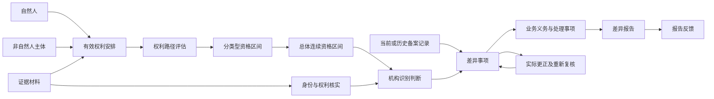

# 受益所有人领域模型审阅稿

版本 0.2.0｜2026-09-16｜DRAFT 待审。依据04领域知识2.1.0（合同4.0.0）；当前模型合同3.0.0。

本版回答业务对象是什么、如何变化、如何作判断。41个业务问题均有模型落点，86个案例均有书面解释；这不表示制度已全量审查，也不表示案例已经由程序执行。04仍有15项开放问题，本版逐项继承，业务确认仍为PENDING。

建议先审阅下图、形成日期、国企简化及差异闭环，再审阅与自己职责有关的流程。可直接按中文概念、问题标题或案例编号反馈。完整映射与全部案例放在[覆盖附件](coverage.md)，机器合同放在[output.json](output.json)。

## 1. 这版模型如何组织业务

自然人和非自然人主体是现实参与者。客户、机构和备案责任是参与者在具体业务中的角色。权利安排记录现实事实；路径评估和资格区间表达判断结果；机构核实和确认仍需要实际责任人及证据。

图中的箭头表示依赖或业务关联，不意味着出现前一个对象就自动产生已确认结论。模型允许资料缺失、冲突、部分识别和未履行义务等真实情形。

## 2. 核心概念及粒度

### 参与者 · M.C.PARTY

在识别、持有权利或承担责任中可被区分的现实参与者；本模型仅将自然人与非自然人业务主体作为两类具体参与者。

**一个对象如何区分：**按自然人或组织、法律安排的身份依据确定；姓名、名称和材料数量不定义身份。

**怎样变化：**建立身份后持续追踪；更名保留身份，实际主体变更另建身份。

**例子：**自然人甲、A公司或某信托安排。 **边界：**同名不是同一参与者的充分依据。

### 非自然人业务主体 · M.C.SUBJECT

识别或备案所针对的公司、合伙、分支机构、信托或资管产品；法律安排不被强称为法人。

**一个对象如何区分：**登记身份及其发放范围；无登记身份的安排以可追溯设立文书和产品身份区分。

**怎样变化：**设立、存续、变更、终止；注销不删除历史判断。

**例子：**外国公司中国分支、家族信托。 **边界：**主体在一个系统中的一条记录。

### 自然人 · M.C.PERSON

最终权利、控制、管理或信托角色能够归属的真实个人。

**一个对象如何区分：**结合证件发放范围与可核实身份材料；换证、更名先核实身份延续，不以单个字段强制合并。

**怎样变化：**个人身份延续；角色和权利变化不创造新人。

**例子：**同一甲分别对两家公司享有不同权利。 **边界：**管理公司本身或一个尚未确定的受益人范围。

### 履责机构角色 · M.C.INSTITUTION

非自然人主体在本次客户尽调、核实和风险管理中的责任身份。

**一个对象如何区分：**承担主体、职责依据和适用期间；具体机构清单仍待补第11号令。

**怎样变化：**职责成立至终止，保留历史履责记录。

**例子：**对开户客户进行识别的银行。 **边界：**平台服务器或持有系统账户就拥有法定权限。

### 客户关系角色 · M.C.CLIENT

非自然人主体在与特定履责机构的具体业务关系中承担的客户身份。

**一个对象如何区分：**主体、机构、业务关系及成立期间共同确定。

**怎样变化：**拟建立、存续、限制、终止；业务状态与识别状态分开。

**例子：**A公司在某银行的客户关系。 **边界：**A公司在另一银行的已尽调记录自动等同本行尽调。

### 备案责任角色 · M.C.FILER

非自然人主体按适用制度承担备案、承诺和更新责任的身份。

**一个对象如何区分：**主体、适用备案制度及责任有效期间。

**怎样变化：**进入范围、设立备案、变更更新、终止；免报仅改变具体报送义务。

**例子：**应对受益所有人信息变化办理更新的公司。 **边界：**承诺免报等于免去银行识别责任。

### 任职与安排参与关系 · M.C.POSITION

参与者在组织或法律安排中承担的具体职责，如法定代表人、日常最高管理人员、委托人、受托人、受益人、监察人或产品管理人。

**一个对象如何区分：**承担者、所属主体、职责类型与有效期间；同一人可有多个职责。

**怎样变化：**任命或约定生效至辞任、替换或职责终止。

**例子：**甲在某信托中是自然人委托人。 **边界：**仅受聘律师直接等于受益所有人。

### 未具体确定的受益人范围 · M.C.BENEFICIARY_SCOPE

信托尚未列明具体受益人时，可由合同识别的受益类别、条件和范围。

**一个对象如何区分：**信托安排、范围约定及有效版本。

**怎样变化：**合同约定成立；人员明确或范围变更时重新识别，保留旧范围。

**例子：**本市符合合同条件的困境儿童。 **边界：**把一个受益人类别虚构成自然人。

### 有效权利安排 · M.C.RIGHT

参与者对主体享有的股权、合伙权益、收益权、表决权或实际控制安排及其期间与证据；属于事实层，尚非UBO结论。

**一个对象如何区分：**权利主体、目标、权利类型、法律或实际安排和连续有效片段；多份证据不增生一份权利。

**怎样变化：**约定生效、比例或支配范围变化、失效；变更产生新片段并关联事件。

**例子：**乙对B的60%股权及B对A的40%股权。 **边界：**一条持股记录或法定代表人头衔直接等于已确认UBO。

### 权利路径评估 · M.C.PATH

同一自然人到目标主体的有序权利链及该链在指定时点的计算或控制解释。

**一个对象如何区分：**自然人、目标、权利维度、判断时点及采用的有序权利片段。

**怎样变化：**事实或时点变更时重新评估；保留原路径依据。

**例子：**60%×40%=24%的无环股权路径。 **边界：**缺失、循环或重复路径被强行折为确定比例。

### 分类型受益所有权资格 · M.C.RELATION

自然人对目标主体在指定标准下达标的关系，承载标准、权利类型、形成终止与资格依据。事实权利与业务记录分类分别保存。

**一个对象如何区分：**自然人、主体、资格标准、权利类型及连续达标区间。

**怎样变化：**达标开始，变化但仍达标则延续；不再达标终止；再次达标新开区间。

**例子：**甲同时按表决权及实际控制满足标准二、三。 **边界：**同一人的两种资格被当成两名自然人。

### 总体连续资格区间 · M.C.QUALIFICATION

同一自然人对同一主体的全部适用资格区间合并后，整体连续满足UBO资格的一段期间。

**一个对象如何区分：**自然人、目标主体、业务场景与一段经证据证明连续的总体资格。

**怎样变化：**整体中断即终止；重新达标新开一段；仅切换权利类型但无空档则延续。

**例子：**2019达标、2021退出、2024重入产生两段区间。 **边界：**取历史最早日期作为当前形成日期，或把未知空档视为连续。

### 判断范围 · M.C.CONTEXT

一次识别、备案或比较所固定的主体、用途、责任机构、业务时点、知识截止和适用制度范围。

**一个对象如何区分：**主体、业务用途与一次固定评估范围；范围变更形成新的评估上下文。

**怎样变化：**发起、补充事实、固定判断；回溯时保留当时可知范围。

**例子：**截至某日、为银行尽调作出的A公司识别。 **边界：**同一主体的备案用途结论自动覆盖银行风险判断。

### 机构业务判断 · M.C.DECISION

责任机构在固定判断范围内对适用性、企业性质、识别名单、简化分支、风险处置或责任风险给出的有依据结论。

**一个对象如何区分：**判断范围、判断事项和一次结论版本。

**怎样变化：**待事实、候选、待核实、可复核结论；新增证据形成新版本，正式确认依实际授权记录。

**例子：**有证据的国企性质结论；与后续可否简化分开。 **边界：**规则命中、系统成功或模型草案等于机构批准。

### 风险评估 · M.C.RISK

对风险触发、加强措施及措施后剩余风险和机构管理能力作出的评估。

**一个对象如何区分：**客户关系、评估时点、所用事实与措施阶段。

**怎样变化：**初始评估、加强措施、剩余风险复评；持续事件触发新评估。

**例子：**复杂跨境结构经补证后的剩余风险。 **边界：**出现风险标签就自动终止业务。

### 核实记录 · M.C.VERIFICATION

将候选人的身份、权利状况或备案信息分别核实的动作、材料和结果。

**一个对象如何区分：**判断范围、核实对象、核实维度和一次核实动作。

**怎样变化：**发起、补证、完成或无法核实；新信息可要求重新核实。

**例子：**权利已核实但身份尚缺证，分别记录。 **边界：**BOMIS返回一致直接代表身份及全部权利已核实。

### 来源陈述 · M.C.OBSERVATION

客户、官方渠道、第三方或系统在某时点给出的主张或记录，保留来源与原始表达。

**一个对象如何区分：**来源、原记录定位、观察时间与陈述对象；重复获取不产生新现实事实。

**怎样变化：**获得、比对、采信或存疑；更正保留原陈述。

**例子：**客户声称已提交更正。 **边界：**未经核实的陈述被当成已发生更正。

### 业务证据材料 · M.C.EVIDENCE

用于支持或反驳身份、权利、生效时间或办理结果的可定位材料及其适用范围。

**一个对象如何区分：**材料出处、版本或签署身份与内容；相同材料多次上传不新增权利。

**怎样变化：**取得、审阅、采用或排除、补充、保留；具体留存期限尚待补依据。

**例子：**完整协议与实际条件满足证明。 **边界：**仅有签字页就证明附条件法律关系已经生效。

### 业务变化事件 · M.C.EVENT

实际设立、权利变化、任职变化、退出重入、更正或关系激活等可触发复核和期限的发生事项。

**一个对象如何区分：**发生对象、事件种类、实际生效事实及证据。

**怎样变化：**事件发生和被获知分别记录；后补材料可更正对事件的认知。

**例子：**权利协议终止日和机构发现日不同。 **边界：**系统录入时间默认作为权利生效时间。

### 备案信息记录 · M.C.FILING

在特定备案时点登记的主体、自然人及权利信息快照，包括当前或历史反馈。

**一个对象如何区分：**备案主体、登记版本或反馈定位及备案时点。

**怎样变化：**提交、更新、查询返回、历史回访；始终与独立识别对照。

**例子：**2025及2026两次历史备案快照。 **边界：**两条快照之间没有记录即证明资格连续。

### 差异事项 · M.C.DIFFERENCE

机构核实信息与可比备案信息或备案义务状态之间的待解释差异，包含涉及人员、要素、成因与处置。

**一个对象如何区分：**目标主体、可比双方版本、人员或义务事项与具体差异；复核关联既有事项。

**怎样变化：**发现、核实成因、处置、重新核对、解决；新事实可重新打开。

**例子：**同一人形成月份不同，另记是否仍在更新期。 **边界：**将报告办结当作差异已解决。

### 业务义务与期限 · M.C.OBLIGATION

在适用规则和事件下由明确主体承担的备案、更新、报告、记录、复核或整改义务。

**一个对象如何区分：**责任主体、义务种类、触发事件与适用制度。

**怎样变化：**触发、计时、履行、延期条件消失、逾期；完成证据与期限分开。

**例子：**实际信息变化起30日的备案更新义务。 **边界：**把30日备案更新和30个工作日报告期限混为同一个日期容差。

### 业务处理事项 · M.C.TASK

为补证、沟通、更正、复核、报告、风险措施或整改而需完成的具体工作。

**一个对象如何区分：**对应对象、事项类型和一轮工作；责任与完成依据明确。

**怎样变化：**待分配、待办理、处理中、待结果、完成或取消；完成需对应业务结果。

**例子：**等待客户实际更正后的重新查询复核。 **边界：**擅自给未确认的待更新事项设定责任人和固定天数。

### 差异报告 · M.C.REPORT

按差异事实、报告类型和适用条件向有权系统提交的报告及其补充、审批、撤销和终止历史。

**一个对象如何区分：**报告主体、报告编号或提交前业务身份；补充与撤销沿原报告关联。

**怎样变化：**拟报、待审核、待补充、办结、终止等按有效反馈记录；提交状态与业务差异分别变化。

**例子：**原报告终止后仍需核实遗漏人员。 **边界：**上传附件成功就是报告获批。

### 外部办理请求 · M.C.REQUEST

核验、查询、上传、报送等一次对外办理意图与其提交关系；只定义业务关联和结果责任，不规定报文结构。

**一个对象如何区分：**机构、业务类型、原始请求身份及关联主体；重复发送仍回到原请求核对。

**怎样变化：**待发送、已提交、初校通过或拒绝、待业务结果、结果返回。

**例子：**批量核验中十个逐户结果分别等待。 **边界：**重复请求被拒说明首次请求已成功。

### 办理反馈 · M.C.RECEIPT

对请求、报告或案例申请的实际初校、业务结果或审批反馈。

**一个对象如何区分：**反馈来源、对应请求或业务对象、反馈阶段和返回记录。

**怎样变化：**获得后保留原文及业务含义；后续反馈不覆盖先前错误历史。

**例子：**案例编号反馈与最终审批结果分别记录。 **边界：**第一条格式校验通过就是最终业务完成。

### 差异案例申请 · M.C.CASE_APPLICATION

基于一份符合条件差异报告的案例申报及审批事项。

**一个对象如何区分：**所关联报告、申请事项及返回案例身份；禁止规定情况下重复申请。

**怎样变化：**拟申请、已受理待审批、审批通过或拒绝；最终结论须最终反馈。

**例子：**获得编号但仍待审批的案例。 **边界：**已受理自动等于已批准案例。

### 适用业务参数 · M.C.PARAMETER

在特定有效期和通知版本内影响查询、核验额度或受理时段的业务约束。

**一个对象如何区分：**参数主题、发布通知及适用期数；多个版本分别保存。

**怎样变化：**通知、补齐缺期、核对适用、替换；不把初始值永久化。

**例子：**当期核验有效期180天。 **边界：**自行补造缺失第6期参数或固化180天永不变化。

### 信息使用授权 · M.C.ACCESS

针对具体用途、人员、对象和责任义务作出的可查询、可使用或拒绝披露决定。

**一个对象如何区分：**请求者、法定目的、授权范围和有效期间。

**怎样变化：**申请、核对、准许或拒绝、使用留痕；技术访问不扩大用途。

**例子：**授权反洗钱案件内查看所需信息。 **边界：**能解密证件号码就可用于营销。

### 适用制度依据 · M.C.RULESET

本次业务使用的制度、机构确认口径或系统规范及其权威、版本和适用期间。

**一个对象如何区分：**发布主体、文件或政策身份、版本及效力期间；用户答复单独标注来源类别。

**怎样变化：**发布、生效、过渡、废止；历史行为适用当时版本。

**例子：**12号令制度要求与用户日期连续口径并列注明。 **边界：**接口文字自动改变制度25%以上边界。

## 3. 关键属性归属

详细属性定义、基数和未知处理均在结构化模型中。以下是最容易放错位置、从而产生业务误判的属性。

| 归属对象 | 属性 | 业务含义 |
| --- | --- | --- |
| 自然人 | 自然人身份要素 | 按用途保存姓名、性别、国籍、出生日期、证件类别号码和有效期等具体要素；备案与机构留存集合分别判断。 |
| 自然人 | 地址与联系方式 | 按适用信息要求留存或备案的住址/工作地址和联系信息。 |
| 有效权利安排 | 控制方式与支配内容 | 单独或联合控制；支配人事、经营、财务、资产或资金的事实和安排。 |
| 有效权利安排 | 权利生效时点 | 核实签署、生效约定和必要条件后取得的实际生效时间。 |
| 有效权利安排 | 权利终止时点 | 权利终止实际生效时间；未知不等于永久存续。 |
| 权利路径评估 | 有序权利路径 | 从自然人到目标主体的有序权利片段及采用的期间、归属。 |
| 权利路径评估 | 路径可评估性 | COMPLETE/PARTIAL/UNSUPPORTED：缺边、代持疑点、环或交叉不提供完整精确结论。 |
| 分类型受益所有权资格 | 资格标准与类型 | 标准一、二、三或兜底、特殊主体/简化分支的资格依据；不是人物永久分类。 |
| 分类型受益所有权资格 | 该类型形成日期 | 该类资格最近连续达标区间的起点；不等于文件签字日。 |
| 分类型受益所有权资格 | 该类型终止日期 | 该类资格不再达标的生效日期，并说明证据精度。 |
| 总体连续资格区间 | 总体当前形成日期 | 最近一段整体连续达标期间的起点，跨类型连续不重置。 |
| 总体连续资格区间 | 总体终止日期 | 所有适用资格均不再满足时总体区间终止；未知类型不断言终止。 |
| 总体连续资格区间 | 连续性结论 | 连续、中断、证据不足；按生效事件及区间证明。 |
| 判断范围 | 业务判断时点 | 要判断现实权利/义务状态的时点。 |
| 判断范围 | 知识截止时点 | 本次允许采用的已获材料截至时点。 |
| 机构业务判断 | 人员清单完整性 | 完整、部分已识别、未知或不适用；单路径达标不证明清单完整。 |
| 核实记录 | 核实维度 | 身份、权利或备案核对；每一维度单独得出结果。 |
| 核实记录 | 核实结果 | 一致、不一致、证据不足、无法取得等，不以字符串成功概括。 |
| 差异事项 | 重大性 | 重大、非重大或待核实；年月差异和认定影响独立判断。 |
| 差异事项 | 时点性待更新 | 近期真实变化仍在适用30日更新期的独立标记，可与重大并存。 |
| 差异事项 | 实质处理状态 | 待核实、待更正、待复核、已解决；状态必须由事实和复核支持。 |
| 业务义务与期限 | 期限口径 | 起算事件、日/工作日/月/年、适用过渡或延期条件。 |
| 差异报告 | 报告办理状态 | 待审核、待补充、办结、终止等按真实反馈与允许迁移保存。 |
| 外部办理请求 | 请求阶段 | 待发送、初校拒绝、初校通过、待业务结果、业务结果已返回。 |
| 差异案例申请 | 案例审批状态 | 拟申报、待审批、通过、拒绝；以对应阶段反馈为准。 |
| 适用业务参数 | 通知期数与生效期 | 通知版本、已掌握期数与适用期间，缺期先补齐。 |
| 有效权利安排 | 直接权利比例 | 直接权利相对被持有主体的同维度总权益比例。 |
| 分类型受益所有权资格 | 最终同类权利比例 | 同一自然人对目标主体同维度去重后的有效路径合计，股权、收益和表决不互加。 |

比例归属于某人对某主体的特定权利与时点，不能挂在人身上成为永久属性。姓名、证件要素不等于完整身份裁定算法；BOMIS新旧人员匹配说明的冲突继续保留，后续接口映射不能反向改变人的定义。

每项类型资格必须对应一个自然人和一个目标主体；一个总体区间可以覆盖多个类型资格。一个客户关系属于一个主体与一个履责机构，同一主体可在多个机构拥有独立客户关系。关键证据关系允许暂缺，用待核实状态表达现实缺失；正式结论的前提仍要求证据满足。

## 4. 六个关键业务承诺

### 4.1 形成日期：分类型区间与总体区间

先核实权利实际生效与终止，再判断是否达标。对于同一个人、同一个主体，合并有证据证明连续的各类资格区间。当前形成日期取最近一段整体连续达标区间的起点。

| 变化 | 各类型如何记 | 总体形成日期 |
| --- | --- | --- |
| 2019-03-01持股30%，2021-05-10降至20%且无其他资格，2024-06-02重新30% | 股权资格形成、终止、重新形成分别保存 | 当前取2024-06-02，并展示中断历史 |
| 2024-05-01持股30%；2026-06-01降至20%，同日经证据证明控制资格生效且无空档 | 股权终止和控制开始均记2026-06-01 | 沿用2024-05-01 |
| 有股权终止但控制协议生效证据不完整 | 旧类型终止已知，新类型开始未知 | 连续性待核实，不能猜测沿用或重置 |

跨类型不重置、真实中断后重开，是继承的用户业务口径。法律关系实际生效有制度依据。两者来源分别保留，不把业务答复说成原文逐字规定。同日日期若不能证明先后和无空档，也要补证。

### 4.2 国企简化：每一步都有自己的依据

32号令企业性质认定 → 备案/12号令适用性判断 → 风险评估及禁用条件 → 对应简化措施。性质判断可以先成立，简化判断仍可能因风险被阻断。

40%国有、第一大股东并有章程协议支持实际支配，只支持先做性质判断；缺控制材料时性质待核实。国有参股不能把整个企业按法定代表人简化。现行“通常直接简化”的操作单独留作现状，是否已具备充分评估证据仍待合规裁定。

### 4.3 一个人可以有多种权利，名单不因此重复

普通无环股权路径相乘、同人多路径合计，25%包含本数；收益和表决分别计算。标准一的备案分类优先不代表删除该人的其他真实权利。标准二与三同时成立可以并列类型。循环、交叉或缺失结构不提供未经确认的精确总比；已知候选和整体清单完整性分开表达。

### 4.4 备案和机构尽调分别承担义务

备案免报、金融机构免识别、金融机构简化是不同判断。1000万元只是承诺免报的一个条件；四项须同时成立。境内分支只有所属主体已是本机构客户且完成有效尽调，才可复用；外国分支还需叠加分支高管，不能用高管代替所属公司穿透。

### 4.5 差异重大性与待更新是两个维度

年月差异是独立重大分支，不需要同时改变人员名单。近期真实变更尚在备案30日更新期可以标待更新，但仍须判断重大性和报告义务。备案30日与差异报告或记录提示的30个工作日分别起算、分别承担，不充当日期容差。

### 4.6 请求、报告和差异分别完成

初校通过只能说明初校通过；报告办结或终止只改变报告状态。客户已实际更正、机构重新查询复核一致，才可将该差异记为已解决。客户表示已申请、上传成功、案例取得编号，都不能跳过对应的最终反馈或实质复核。

## 5. 24组判断流程

每组流程对应一个主问题及其子问题。先看输入和步骤，再看缺证时停在哪里；没有预设所有流程都能得到肯定结论。

### 01 · 分别判定备案与机构识别范围

**用于：**哪些主体和业务关系适用受益所有人要求？

**读取：**非自然人业务主体、客户关系角色、履责机构角色、判断范围、业务证据材料。

1. 已有组织形式、登记资料和业务关系：区分公司、合伙、外国分支、其他非自然人和个体工商户，核对履责机构依据。 缺失时：主体类别或机构范围未知时请求身份依据。
2. 主体与职责类别有依据：分别形成备案适用和金融机构识别适用两个判断，生成各自责任事项；暂无需备案不推成免尽调。 缺失时：缺第11号令时保留完整机构清单限制。

**形成：**机构业务判断、业务义务与期限。

### 02 · 四项条件合取判断承诺免报

**用于：**备案主体能否承诺免报？

**读取：**非自然人业务主体、备案责任角色、有效权利安排、判断范围、业务证据材料。

1. 准备真实承诺：核对资本币种金额、股东是否均自然人、外部自然人控制获益和股权外安排；先排除外国公司及其分支不适用。 缺失时：有任一条件未知时补证。
2. 四项条件有明确真值：全部满足才可免具体备案，仍保留银行识别义务；不满足则自行填报。 缺失时：外币折算未定时停止边界金额确定判断。
3. 失去免报条件或未能证明：安排30日更新或补证事项，真实承诺由主体承担。 缺失时：起算事实缺失不伪造截止日。

**形成：**机构业务判断、业务义务与期限、业务处理事项。

### 03 · 股权及合伙权益逐人计算

**用于：**谁按股权、股份或合伙权益标准成为受益所有人？

**读取：**自然人、非自然人业务主体、有效权利安排、业务证据材料、判断范围。

1. 固定判断时点和最终权利归属：核对每条权利的持有人、目标、同维度比例和生效片段，识别代持、缺边、环与交叉。 缺失时：缺失边或归属存疑保留断点。
2. 普通无环且路径证据完整：建立有序路径，逐路径相乘，同一自然人去重后合计；循环交叉不提供未经确认算法。 缺失时：不支持或不完整路径保持未知而非0。
3. 取得可核实路径比例：逐人以>=25%判标准一资格；保留其他自然人识别和其他标准，名单另标完整/部分。 缺失时：有局部达标但整体缺证仅可给候选和部分名单。
4. 发现未覆盖结构或接口阈值冲突：创建补证、计算口径或报送适配澄清事项，不改变业务25%边界。 缺失时：不得把待明确算法当已执行。

**形成：**权利路径评估、分类型受益所有权资格、机构业务判断、业务处理事项。

### 04 · 收益权和表决权分别判断

**用于：**谁按收益权或表决权标准成为受益所有人？

**读取：**自然人、非自然人业务主体、有效权利安排、权利路径评估、判断范围、业务证据材料。

1. 权益归属和协议有效：区分基于权益的收益与普通工资顾问费，分别取得收益、表决和已满足标准一的事实。 缺失时：安排和分母不明时补证。
2. 各维度有效且可计算：同一自然人各自计算收益、表决总量，不跨维度相加。 缺失时：不支持结构保持未知。
3. 已分别核实收益或表决比例：任一>=25%形成标准二；已满足标准一者按标准一备案，其他权利事实仍保存；与实际控制同时成立可并列类型。 缺失时：不得因只不满足标准二而排除所有其他标准。

**形成：**分类型受益所有权资格、机构业务判断。

### 05 · 实际控制证据判断

**用于：**谁通过单独或联合实际控制成为受益所有人？

**读取：**自然人、非自然人业务主体、有效权利安排、任职与安排参与关系、业务证据材料、判断范围。

1. 存在权力来源与实际行使线索：分别检查单独/联合安排及人事、经营管理、财务、资产、资金支配事实。 缺失时：标签、亲属或职务线索不能填补协议/行权缺口。
2. 具有持续、实质支配证据：结合协议和实际记录判断控制是否成立，不设固定持股门槛；外部无约束顾问可有明确排除依据。 缺失时：无法核实的只留线索与补证事项。
3. 控制结论和业务范围明确：符合标准三才建立资格；保留单独/联合方式及具体内容，未达证据要求创建补证。 缺失时：不将实际控制人与UBO身份完全等同。

**形成：**分类型受益所有权资格、机构业务判断、业务处理事项。

### 06 · 确认无前三类达标者后兜底

**用于：**三项标准均无人满足时如何处理？

**读取：**非自然人业务主体、自然人、任职与安排参与关系、机构业务判断、判断范围、业务证据材料。

1. 已完成完整结构和前三项排查：核对无人满足的证据，明确不是查询失败或材料不全。 缺失时：任一项未知即停止兜底并补证。
2. 三项均无人满足且管理职责可证：从实际日常经营管理最高层级选至少一名，记录层级职责、选择理由和兜底依据。 缺失时：同层多人优先顺序无确认口径时列问题，不任意排成唯一人。
3. 选择标准或排查证据仍缺：建立责任人审查和补证事项。 缺失时：兜底人员不因此变为实际控制人。

**形成：**分类型受益所有权资格、机构业务判断、业务处理事项。

### 07 · 国企性质到简化的分步判断

**用于：**国有企业何时可进入法定代表人简化识别？

**读取：**非自然人业务主体、有效权利安排、任职与安排参与关系、风险评估、业务证据材料、判断范围。

1. 核对32号令适用出资主体：在未超过50%分支核对第一大股东及协议、章程、决议等实际支配依据。 缺失时：缺主体资格或实际支配证据不作性质确定结论。
2. 对应32号令性质条件已核实：形成国有实际控制等性质判断；国有相对控股的应用口径注明来源为已有用户答复。 缺失时：国有参股不能扩为整企控股。
3. 已知企业性质和业务用途：分别选择备案与12号令适用分支；参股仅处理国有资本部分。 缺失时：不得跳过用途与适用条款判断。
4. 拟适用金融机构简化：检查已做充分风险评估及第二十条、第二十五条禁用情形；现行三类例外不能穷尽。 缺失时：风险或性质未知不得自动简化。
5. 性质、适用性和风险门控全部成立：才选择法定代表人等对应简化资格；不满足则一般/加强并生成补核事项。 缺失时：保持已证明性质，单独阻断简化，不把局部未知扩大为全部作废。

**形成：**机构业务判断、分类型受益所有权资格、业务处理事项。

### 08 · 境内外分支区别识别和复用

**用于：**分支机构的受益所有人如何识别？

**读取：**非自然人业务主体、客户关系角色、机构业务判断、任职与安排参与关系、业务证据材料、判断范围。

1. 所属关系和境内外性质明确：定位所属公司、分支及本机构既有客户尽调记录。 缺失时：所属关系缺证时补证。
2. 境内分支：一般沿用所属主体UBO；仅所属主体是本机构客户且已完成有效尽调才复用记录。 缺失时：无本行记录则围绕所属主体完成识别，不伪称复用。
3. 外国公司分支：识别外国公司UBO并叠加至少一名分支高管；本国豁免不结束中国义务。 缺失时：仅高管材料齐备仍是部分名单，继续所属公司穿透。

**形成：**机构业务判断、分类型受益所有权资格、业务处理事项。

### 09 · 信托与资管专门分支

**用于：**信托和资产管理产品如何识别受益所有人？

**读取：**非自然人业务主体、自然人、任职与安排参与关系、有效权利安排、风险评估、业务证据材料、判断范围。

1. 产品与安排类型明确：核对信托类型、当事人、合同权力及产品募集登记、服务类型、管理职责。 缺失时：不能仅按产品名称选简化。
2. 信托完整识别分支：列全当事人与其他最终控制自然人；非自然人当事人逐层追溯；受益人未具体明确则记录范围条件。 缺失时：某一非自然人当事人未穿透时仅该部分待补，不虚构自然人。
3. 资产服务信托或资管有相应简化可能：按各自类型、风险、募集登记和业务关系条件选择程度；管理自然人必须有职责依据。 缺失时：团队/委员会多人选择未定不得默认法定代表人。
4. 拟采信信托公司识别材料：核实体系健全有效履责和材料无疑点；有瑕疵要求重识别，不配合则风险管理。 缺失时：合作关系不转移本机构责任。

**形成：**分类型受益所有权资格、未具体确定的受益人范围、机构业务判断、业务处理事项。

### 10 · 分用途记录身份权利与时间

**用于：**备案主体与金融机构分别需要记录哪些受益所有人身份信息、权利状况和时间信息？

**读取：**自然人、非自然人业务主体、有效权利安排、分类型受益所有权资格、判断范围、业务证据材料、备案信息记录。

1. 备案或金融机构用途已区分：分别选择3号令完整备案要素与12号令机构留存集合；透明充分客户的较少要素只用于相应机构场景。 缺失时：用途或透明条件未知不减少要素。
2. 身份材料和权利依据已取得：核实应记录的身份、地址联系方式及证件要素，按类型记录比例/控制方式及法律生效形成终止时间；准备填报内容与实际取得的备案快照分开。 缺失时：缺项不填造；未实际办理不能生成已登记备案快照。
3. 需完善缺项或生效材料：生成补证与核对事项，区分识别、记录和真实备案完成。 缺失时：不得借最低留存要求降低备案集合。

**形成：**核实记录、业务处理事项。

### 11 · 类型区间和总体连续资格

**用于：**受益所有权关系形成和终止日期如何确定？

**读取：**自然人、非自然人业务主体、有效权利安排、分类型受益所有权资格、业务变化事件、业务证据材料、判断范围。

1. 存在权利生效终止材料：分别核对签署、生效约定、条件满足和达标时点；保持时间精度和缺证位置。 缺失时：只有签字页或缺历史证据不填日期。
2. 每种关系的达标变化已核实：为各类型建立达标区间，达标中比例变化仍连续，退出后终止并保留原因。 缺失时：某类型生效不明则该段未知。
3. 同人同主体且区间边界连续性可证：合并全部适用资格区间；取当前最近连续区间起点，跨类型无空档不重置，整体中断后新开区间。 缺失时：同日但先后/生效不明不得强行合并。
4. 当前形成日期或回访需要解释：展示历次起点、终止、中断和重入，以及每个类型的日期依据；未知部分生成补证。 缺失时：历史快照和发现日期不替代实际生效。

**形成：**总体连续资格区间、分类型受益所有权资格、业务处理事项。

### 12 · 分别计算备案及存量识别义务

**用于：**备案主体设立、信息变化、免报条件失效，以及金融机构存量客户治理分别适用什么期限？

**读取：**非自然人业务主体、客户关系角色、备案责任角色、业务变化事件、风险评估、判断范围、业务证据材料。

1. 能够定位设立、变化、失效或存量身份：区分线上同步设立、现场设立、变更、免报条件失效和金融机构存量关系。 缺失时：风险等级或起算事件缺证时不取延期。
2. 适用日期与事件明确：分别设置30日备案、存量2025-11-01及12号令生效后6个月/2年要求；符合不动/严格限制例外者记激活办理触发。 缺失时：不具备工作日日历等条件时不制造精确日期计算。
3. 需要执行或延期恢复：形成分层办理计划和责任事项，保留完成证据。 缺失时：延期不作为永久免履行。

**形成：**业务义务与期限、业务处理事项。

### 13 · 识别后分维度核实

**用于：**金融机构应依据哪些来源、材料和判断步骤识别并核实受益所有人？

**读取：**非自然人业务主体、自然人、有效权利安排、任职与安排参与关系、来源陈述、业务证据材料、判断范围。

1. 组织或产品类型已知：使用相应章程、协议、名单和权利材料解释结构到自然人。 缺失时：材料不足时记录结构断点。
2. 结构足以提出候选：形成候选与识别路径，不能将BOMIS名单直接当全部识别。 缺失时：单一声明或名单一致不证明完整。
3. 进入核实阶段：身份优先官方渠道，权利以客户佐证为基础并按需多源验证；低风险直接采信仅及相应权利分支。 缺失时：各维度独立保留缺证。
4. 客户属于备案主体：查询核对BOMIS并衔接差异处理；保留少取材料和采用理由。 缺失时：查询待完成不妨碍其他可完成核实，也不表示整个流程通过。

**形成：**机构业务判断、核实记录、业务处理事项。

### 14 · 加强措施到剩余风险处置

**用于：**哪些事实触发加强识别，如何选择加强措施，何时才限制、拒绝或终止业务？

**读取：**客户关系角色、非自然人业务主体、有效权利安排、来源陈述、业务证据材料、判断范围。

1. 有风险触发事实：核对高风险来源、复杂结构、境外核实困难、可靠性疑点、异常频繁变更等全部适用情形，按所引知识条款范围处理。 缺失时：证据存疑先核实，不因现行三例外未命中就认为无风险。
2. 需要加强识别：选择相称补充来源、回访、进一步佐证、管理审批、提高频率等一种或多种措施并落实。 缺失时：措施尚未执行不能声称风险已降低。
3. 已取得加强措施实施结果：评价剩余风险与本机构能力，分别决定继续、合理限制；超出管理能力才拒绝或终止。 缺失时：未完成能力评估不得一刀切退出。

**形成：**风险评估、机构业务判断、业务处理事项。

### 15 · 免识别、简化与免报分流

**用于：**金融机构何时可以免于识别或采取简化识别，备案承诺免报与其有何区别？

**读取：**非自然人业务主体、备案责任角色、任职与安排参与关系、风险评估、业务证据材料、判断范围。

1. 主体性质和业务用途有依据：核对第十条免识别封闭清单及第十一、十三、十四条各简化分支。 缺失时：无法准确判断时一般识别，不按相似名称扩张。
2. 拟免识别或简化：检查第二十条风险与第二十五条禁用条件；对国有参股仅处理国有资本部分。 缺失时：风险或条件未知不得豁免简化。
3. 允许对应分支且职责可核实：免识别保留性质依据；简化选对应负责人/法定代表人/管理自然人；备案承诺免报另判。 缺失时：备案免报不取消机构识别；按缺口继续补证。

**形成：**机构业务判断、分类型受益所有权资格、业务处理事项。

### 16 · 持续关注与事件复核

**用于：**业务关系存续期间出现哪些事件应审核或更新受益所有人信息，复核频率如何确定？

**读取：**客户关系角色、业务变化事件、有效权利安排、机构业务判断、风险评估、业务证据材料、判断范围。

1. 发生可能影响受益所有权的事件：核对事件生效与可能受影响的人、关系及旧结论。 缺失时：不知影响时先审核不默认无影响。
2. 变化影响可评估：决定是否需要更新UBO、关系终止或证据；普通无影响董事更换可只保留影响分析。 缺失时：控制和职责变化缺证则补证。
3. 需要更新或风险加强：安排更新与相称复核频率；全客户固定周期尚无制度或机构政策时不自定。 缺失时：周期口径缺失不阻止事件触发复核。

**形成：**机构业务判断、业务处理事项。

### 17 · 备案查询核对和未备案辨别

**用于：**如何查询核对备案信息，查不到信息时怎么办？

**读取：**非自然人业务主体、机构业务判断、备案信息记录、外部办理请求、办理反馈、判断范围、业务证据材料。

1. 机构已有独立识别或可进行的核实：检查是否取得实际业务反馈，分辨技术失败、暂无需备案、承诺免报与应备案未备案。 缺失时：无反馈不推定未备案。
2. 已取得可比备案信息或确认义务未履行：按人、身份和权利比对；确认应备案未备案的先提示。 缺失时：无法确定义务则补材料或重查。
3. 提示后仍未依法备案或有其他差异：进入相应差异报告或继续核实事项，保存沟通证据。 缺失时：流水失效先重新核验，不能把故障当拒不备案。

**形成：**核实记录、差异事项、业务处理事项。

### 18 · 重大性与时点性分别判断

**用于：**差异如何区分重大、非重大和时点性待更新？

**读取：**自然人、差异事项、备案信息记录、核实记录、业务变化事件、判断范围、业务证据材料。

1. 双方信息可比且人员可定位：核对同一人、关键身份、关系类型、比例和形成终止日期的具体差值。 缺失时：人员未匹配或核实未完成先查成因。
2. 差异事实充分：分别检查年月差异、人员/关系类型认定影响及其他列举重大情形，任一重大分支成立即重大；同月日差且无其他实质影响可非重大。 缺失时：不要求年月差异还同时改变人员认定。
3. 近期真实变更有生效证据：单独标注是否在30日备案更新期内；可与重大并存，报告或记录提示义务仍独立判断。 缺失时：变更时间未知则不能标已处合法更新期。
4. 需要后续查询或待更新跟踪：创建复核事项，责任、时点、超期升级按待确认缺口保留。 缺失时：不凭更新期标记自动豁免报告。

**形成：**差异事项、业务义务与期限、业务处理事项。

### 19 · 查明成因后更正报告和实质闭环

**用于：**发现差异后如何沟通、报告和闭环？

**读取：**差异事项、核实记录、备案信息记录、业务变化事件、风险评估、业务证据材料、判断范围。

1. 发现差异并沟通核实：判明机构错误、备案错误或近期真实变更；保存过程和理由。 缺失时：不能仅相信口头更正承诺。
2. 成因和重大性已有依据：机构错误则自身更正；备案错误且重大按期报告，非重大记录提示；应报可疑交易独立处理。 缺失时：非重大接口可报备不自动增加法定义务。
3. 有实际更正证据并重新取得核对结果：机构再次比较涉及人员、身份和权利；一致才将该差异已解决，保留历史报告和其他存续义务。 缺失时：不一致或未回查保留待处理/复核。
4. 同时需决定是否维持业务关系：单独判断风险可控性；有报告义务并不必然终止业务。 缺失时：风险不明时另行评估，不以报告结果替代。

**形成：**差异事项、差异报告、业务处理事项、业务义务与期限。

### 20 · 授权目的和留存保密

**用于：**谁可以因何目的获取、查询和使用受益所有人信息，查询传输和后续使用如何保密？

**读取：**履责机构角色、客户关系角色、外部办理请求、业务证据材料、判断范围。

1. 拟获取或使用UBO信息：确认查询人、业务对象、具体法定职责或反洗钱目的及权限。 缺失时：目的或权限不成立即停止使用披露。
2. 目的授权明确：决定可用范围，保留访问和采用记录，后续用途不得扩大；技术传输认证加密属实现责任边界。 缺失时：技术通过不补足业务授权。
3. 需要保存或后续披露：安排必要留存保密及档案规则补充事项；不填写来源未规定的10年期限或起算日。 缺失时：保存期限仍待补规范，不默认为永久或立即删除。

**形成：**信息使用授权、业务处理事项。

### 21 · 制度时点、过渡与责任风险

**用于：**3号令和12号令何时生效、如何过渡，哪些违法类型对应何种整改或责任？

**读取：**非自然人业务主体、履责机构角色、业务变化事件、业务义务与期限、业务证据材料、判断范围、适用制度依据。

1. 行为发生时点可证：选3号令/12号令生效与过渡范围；废止文件不作为新行为默认标准。 缺失时：行为时点未知不确定适用版本。
2. 具体义务、履行和危害事实可核实：区分备案、一般识别、严重识别、风险管理、差异与内控责任风险，分别收集整改与从轻减轻材料。 缺失时：上位法全文未入知识时不作个案最终处罚。
3. 有责任风险需要处理：交法务核对行为时点的完整依据与程序，并形成整改事项。 缺失时：从轻材料不自动免责，罚款上限不等于确定金额。

**形成：**机构业务判断、业务处理事项。

### 22 · 备案办理业务过程

**用于：**备案人员如何按所在地指引完成填报？

**读取：**备案责任角色、非自然人业务主体、自然人、分类型受益所有权资格、业务证据材料、判断范围。

1. 地区、主体分类和人员材料明确：按所在地指引准备账户权限、全部人员、各权利类型及形成日期，选择真实符合的填报方式。 缺失时：账户不合要求只阻塞办理，不改变已得业务判断。
2. 具备适用流程条件：录入全部人员与关系后核对并确认提交；国企备案选项不替代银行风险门控。 缺失时：材料缺项保留待办，不伪造提交结果。
3. 已取得实际办理结果：保存该次备案记录，后续变化按义务更新。 缺失时：未获结果只能待结果，地方页面完成不证明机构尽调完成。

**形成：**外部办理请求、备案信息记录、业务处理事项。

### 23 · 核验、当前与历史查询

**用于：**BOMIS核验、当前查询和历史查询如何衔接？

**读取：**非自然人业务主体、外部办理请求、适用业务参数、信息使用授权、办理反馈、业务证据材料、判断范围。

1. 授权与当期参数具备：确定核验/当前/历史类型，核对额度、批量规模、核验流水有效期和主体可查询状态。 缺失时：参数或有效流水缺失先补，180天只是适用参数示例。
2. 请求已实际提交：区分初校与实际业务反馈；批量临界额度按所引规则整个批次处理，后续请求不推定处理；逐户等待结果。 缺失时：只有格式通过则业务待返回。
3. 取得当前或历史详情反馈：记录备案快照并与机构独立识别比较；当前查询失败可重核验后查询。 缺失时：没有逐户反馈不写完成。
4. 历史回访要解释资格变化：核对实际权益生效事件；证据齐备展示旧区间、中断和新形成，快照不足创建补证。 缺失时：不从历史登记时点代替真实权利时点。

**形成：**外部办理请求、备案信息记录、核实记录、业务处理事项。

### 24 · 报告办理、案例与外部反馈

**用于：**差异报告、案例、通知和文件如何配合完成办理？

**读取：**差异事项、差异报告、外部办理请求、办理反馈、适用业务参数、业务证据材料、判断范围。

1. 核实事实后准备报告：按在库状态、人员、资料完整性及报告类别准备内容，分别记录法定义务与系统可报类型。 缺失时：非重大报备与阈值/身份字段冲突保持待澄清。
2. 通知参数齐备且在受理状态：附件取得实际文件身份后关联提交，初校与业务结果分开；缺期补通知，重复拒绝追原请求。 缺失时：上传无最终文件身份不声称附件齐备；失败原因先查明。
3. 取得对应报告真实反馈：待补充则补件；撤销只在允许状态提出并等待结果；办结和终止只改变报告状态。 缺失时：报告已办结不再按待审撤销逻辑处理。
4. 报告符合案例申报条件且无禁止重复：形成案例申请，初始编号仅受理待审批，最终反馈才更新审批结果。 缺失时：报告状态不适用或已有在途/批准案例不重复申请。
5. 报告处理后仍需核对差异：按最新事实重新查询复核，保留历史报告，未实质解决继续处理。 缺失时：不得把终止/撤销/办结传播为已解决。

**形成：**差异报告、外部办理请求、差异案例申请、业务处理事项。

## 6. 用案例审查模型

全部86个案例及其原始预期、禁止结果和本模型解释见覆盖附件。这里选取六组最能区分模型是否正确的例子；均为上游合成案例，没有执行真实客户判断。

### K.C.IDENT.Q03.02

自然人乙通过B公司路径最终拥有A公司60%×40%=24%股权。；乙同时直接拥有A公司2%股权，两条路径均有效且最终归属于乙。

**模型怎样表达：**权利路径评估一0.6×0.4=0.24，权利路径评估二0.02；同人同维度总和0.26，最终同类权利比例支持标准一。

**原知识预期：**乙按标准一成为A公司受益所有人，记录两条路径和合计26%。

**禁止：**不得只取最大单一路径24%而遗漏可归属的直接2%路径。

### K.C.IDENT.Q03.04

C公司持有A公司70%，自然人丙持有C公司40%。；另有一家持有C公司30%的境外公司无法取得股东资料，且存在代持线索。

**模型怎样表达：**丙已知路径0.4×0.7=0.28可记录候选；境外资料和代持未知另标路径断点，人员清单完整性为部分。

**原知识预期：**丙的已知达标路径可记录为候选并核实；整体受益所有人清单为证据不足，补充境外登记和代持协议。

**禁止：**不得把未知境外层按零、把已识别丙一人写成全部受益所有人。

### K.C.REVIEW.TYPE_CONTINUITY

甲自2024年5月1日起因30%股权达标且持续；2026年6月1日股权降至20%。；已核实的控制协议于2026年6月1日同时生效，足以支持实际控制；总体资格没有空档。

**模型怎样表达：**2026-06-01股权资格终止而控制资格同日有效且已证明无空档，两个分类型受益所有权资格各记日期，总体连续资格区间仍从2024-05-01开始。

**原知识预期：**总体形成日期沿用2024年5月1日，股权类型终止与控制类型形成分别记2026年6月1日。

**禁止：**不得把总体日期重置为类型切换日；不得将本轮口径称为制度原文直接规定。

### K.C.PILOT.09

同一人的备案形成日期为2022年3月15日，本机构有依据的形成日期为2022年4月15日；当前人员名单相同。

**模型怎样表达：**同一人的两侧月份3月/4月进入差异要素与两侧值；第18组流程的年月分支独立命中重大，不要求名单变化。

**原知识预期：**进入重大差异及成因核实流程。

**禁止：**不得以UBO人员未变化为由直接认定非重大。

### K.C.PILOT.11

主体于2026年7月1日实际发生受益所有人信息变化，7月10日查询时备案仍是原信息，并取得变更生效证据。

**模型怎样表达：**7月1日业务变化事件和7月10日判断范围支持时点性待更新；另运行重大性判断，跟踪业务处理事项的责任及复核时间仍待确认。

**原知识预期：**标记待更新，登记变更时点、复核事项及责任待补项；继续重大性判断。

**禁止：**不得认定两日期相差不超过30日即无差异，也不得自动顺延报告时限。

### K.C.EXT.OPS.24.S1

甲报告收到因主体信息更新而终止的系统反馈；机构重新查询发现乙仍遗漏。

**模型怎样表达：**差异报告状态按反馈终止，新的核实记录仍见乙遗漏则差异事项不关闭；旧报告及新事实关联继续办理。

**原知识预期：**保留旧报告及终止回执，继续核实并按最新事实处理差异。

**禁止：**不得将终止自动映射为已解决。

## 7. 需要业务评审的事项

已回答的总体日期连续口径、国企判断顺序和差异闭环不重新列作无人回答的问题；本轮需要检查这些口径在模型中的表达是否忠实。仍开放的问题如下。

| 事项 | 未解决前怎样处理 |
| --- | --- |
| 近期变更处于法定30日更新期时，应标记时点性待更新，这一选择已有用户答复；后续复核责任、复核时点和超期升级操作尚需明确。 | 标记待更新并保留跟踪，不能把30日作为日期容差或差异豁免；不臆定内部处置时限。 |
| 12号令第二条把适用机构范围交由2025年第11号令规定，但该令不在用户限定的七份制度原文中，因此当前不能列出完整义务机构清单。 | 仅表述为‘第11号令规定的客户尽调义务机构’，不按常识、机构名称或历史清单穷举。 |
| 3号令第三条允许以等值外币判断1000万元免报边界，但限定材料没有规定折算日期、汇率来源或舍入方法。 | 外币注册资本接近边界时返回证据不足，不自定汇率或容差；人民币案例按小于等于1000万元执行。 |
| 第二版备案指南说明普通多层路径乘算和同一自然人多路径合计，12号令把循环嵌套、交叉持股列为需加强的复杂结构，但限定材料没有给出循环或交叉持股的封闭比例算法。 | 普通无环结构按逐路径相乘和同一自然人合计；循环、交叉结构停止精确比例与完整清单结论并加强核实。 |
| 12号令第十四、十七条要求简化时认定并取得‘管理资产管理产品的自然人’信息，但没有界定多人团队、投资决策委员会或管理职责分散时应选择哪些自然人。 | 不得默认选择管理机构法定代表人、产品经理或任一经办人；事实不足时保持证据不足。 |
| 本次唯一权威输入要求金融机构识别留存并依法保密，但未载明保存10年，也未说明从业务关系终止、交易完成或其他事件起算。 | 只陈述现有留存义务，不写10年、不自定起算日。 |
| 12号令规定事件触发审核，并允许加强情形提高审核更新频率，但本次来源未给全部客户统一固定复核周期。 | 执行事件触发复核；加强情形提高频率，但不填造季度、年度等统一周期。 |
| 3号令和12号令的责任条款继续引用企业登记管理行政法规及反洗钱法第五十二至五十四条，本次7份来源未包含这些全文。 | 可识别规章内违法类型和档位，不作具体案件必然处罚结论。 |
| 非重大差异无需法定差异报告，与接口“非重大差异报备”功能如何在本机构衔接？ | 可完成差异识别和非重大差异记录；不将接口可报备自动变成必须报送。 |
| BOMIS补充类个别说明写比例>25%，与制度“25%以上”及25%边界如何一致？ | 业务识别依制度边界；该报送边界未经明确前不能声称已完成接口适配。 |
| V2.0修订说明与附录旧错误码对人员匹配和必填项存在不一致，使用哪套字段规则？ | 可继续业务判断与材料整理；不将未经澄清的字段匹配顺序作为已核验运行事实。 |
| 国企简化的现行操作已经澄清，但“通常直接简化”的做法与制度要求的充分风险评估之间仍需合规裁定。 | 制度链条继续作为应遵守的判断依据；现状单列。不得把评审记录“冲突解除”解释为合规差异已经裁定。 |

此外，04全量原文仍有未完成的语义回读，本版不能证明制度无遗漏。模型对象粒度、职责分离和反馈状态是作者建模选择，须由业务读者用反例检验；并非每个概念名称都来自制度原文。

## 8. 如何评审并回来更新

当前按“先产出一版看看”交付草案，未记录任何本轮业务批准。可以在会话中逐项答复，也可把本稿和覆盖附件线下转交。反馈请注明本版0.2.0、审阅人及角色、日期、问题/概念/案例、同意或需改、理由及补充案例。

收到反馈后，先保留原始答复，再修订模型、案例解释和影响范围，产生新版本。对模型表达的修改在本阶段处理；对原知识规则或预期的修改先返回04处理。本轮不直接改写上游知识。正式确认需要固定版本、摘要、范围、审阅材料与真实答复；未确认部分继续待审，不因一题已答而全版解除。

合同检查只证明结构、引用、版本、覆盖条目和案例预期保持一致。业务是否正确、读者是否理解、所有制度是否覆盖，须分别审阅。本版不包含数据库、接口字段映射、ECP资产、发布或运行结果。
